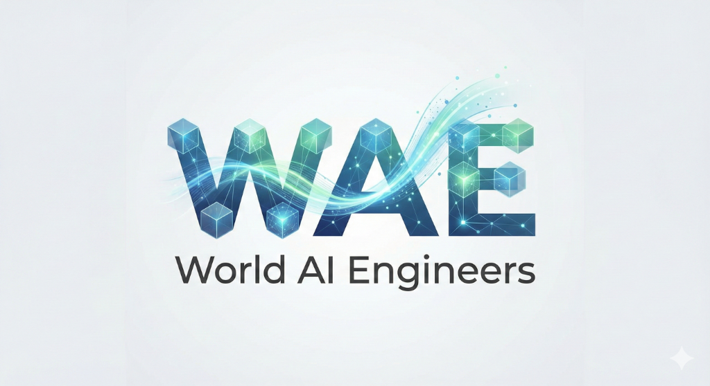

# WAE - World AI Engineers



## 🚀 Transformación Digital Inteligente

Sitio web corporativo de **WAE (World AI Engineers)**, una consultora tecnológica especializada en:

- **Co-Creación Ágil** - Desarrollo de software a medida
- **Infraestructura & Cloud** - Cloud-Native, sistemas Legacy y On-Premise
- **IA Aplicada** - Automatización inteligente con N8N

## 📁 Estructura del Proyecto

```
PaginaWeb/
├── index.html          # Página principal
├── theme.css           # Estilos del tema (oscuro/claro)
├── styles.css          # Estilos adicionales
├── scripts.js          # Funcionalidad JavaScript
├── logo-wae.png        # Logo principal
└── README.md           # Este archivo
```

## 🎨 Características

- ✅ Diseño "Deep Tech Enterprise" 
- ✅ Modo oscuro y claro con toggle
- ✅ Totalmente responsive
- ✅ Animaciones suaves
- ✅ SEO optimizado

## 🛠️ Tecnologías

- HTML5
- CSS3 (Variables CSS, Flexbox, Grid)
- JavaScript (Vanilla)
- Google Fonts (Inter)
- Material Symbols

## 🚀 Uso

Simplemente abre `index.html` en tu navegador:

```bash
open index.html
```

O despliega en cualquier servidor web estático (GitHub Pages, Netlify, Vercel, etc.)

## 📄 Licencia

© 2026 WAE - World AI Engineers. Todos los derechos reservados.
